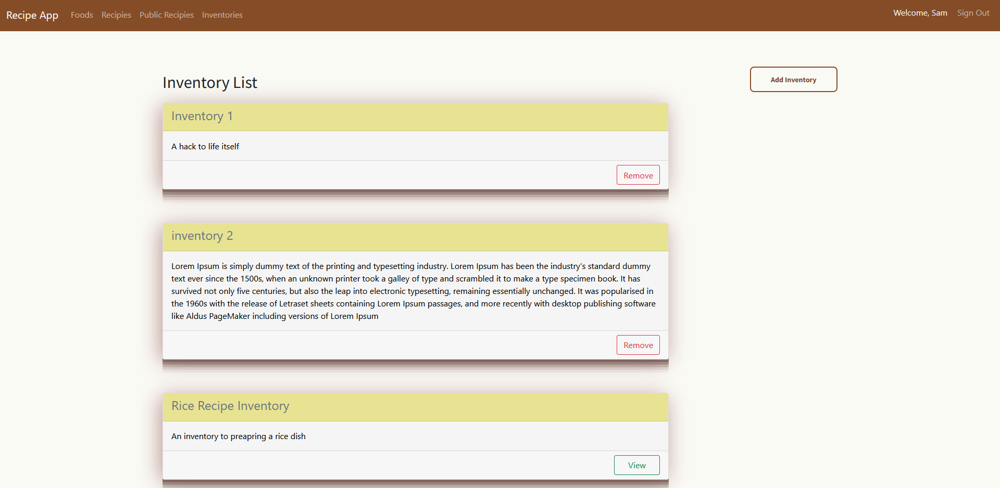

# Recipe App

> The Recipe app keeps track of all your recipes, ingredients, and inventory. It will allow you to save ingredients, 
keep track of what you have, create recipes, and generate a shopping list  based on what you have and what you are missing 
from a recipe. Also, since sharing recipes is an important part of cooking the app should allow you to make them public so anyone can access them.

## Project screenshots



Additional description about the project and its features.

## Built With

- RUBY on RAILS
- PostgreSQL
- Bootstrap
- Devise
- RSPEC
- SCSS

## How to Setup

> You can simply clone or download [this repository](https://github.com/Tumworobere/Recipe-App.git), and use your favorite browser or code editor to run this program.

- To open the project after download, simply double click the index.html file

- To open this project using vs code ( for this example) or your favorite code editor, you can follow the guide below:
  > in your cmd or command line navigate to where this project is located, then;

```cmd
cd Recipe-App
```

> thereafter run

```cmd
code .
```

## How to Run the App through terminal

- To run the application through trminal, make sure ruby and IRB is installed in your computer then follow the guide below:
  > in your cmd or command line navigate to where this project is located, then;

```cmd
cd Recipe-App
```

## Install Gems

```cmd
bundle install
```
> then initialize the database

```cmd
rails db:reset
```
Incase its the first time:

```cmd
rails db:create
```
then

```cmd
rails db:migrate
```

```cmd
rails db:test:prepare
```
> thereafter run

```cmd
.rails s
```

## Authors

👤 **Mongare S.**

- [@githubhandle](https://github.com/Mosams/)
- [@twitterhandle](https://twitter.com/sam_mongare)
- [LinkedIn](https://www.linkedin.com/in/sammy-mongare-b8288310b/)

👤 **Anselem Odimegwu**

- GitHub: [@AnselemOdims](https://github.com/AnselemOdims)
- LinkedIn: [AnselemOdims](https://linkedin.com/in/anselem-odimegwu)

👤 **ANNAH TUMWOROBERE**

- GitHub: [@githubhandle](https://github.com/Tumworobere)
- Twitter: [@twitterhandle](https://twitter.com/Tannah2090)
- LinkedIn: [LinkedIn](https://linkedin.com/in/annah-tumworobere)

## 🤝 Contributing

Contributions, issues, and feature requests are welcome!

Feel free to check the [issues page](../../issues/).

## Show your support

Give a ⭐️ if you like this project!

## Acknowledgments

- Microverse Team for facilitating project requirements and resources

## 📝 License

This project is [MIT](./LICENSE) licensed
